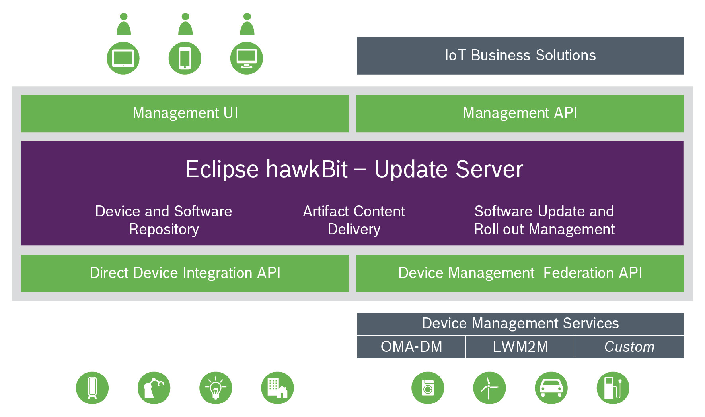
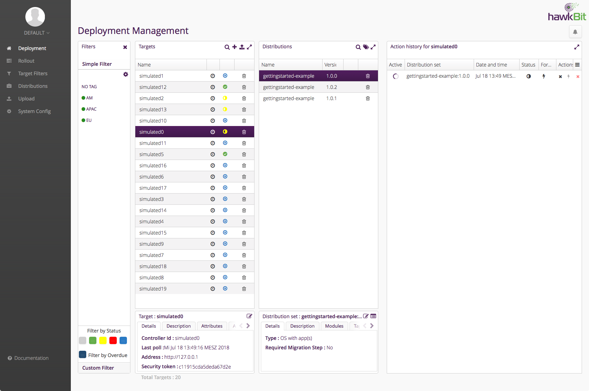

# Eclipse hawkBit 0.2.0 - First Release

hawkBit is a domain independent back-end framework for rolling out software updates to constrained edge devices as well 
as more powerful controllers and gateways connected to IP based networking infrastructure. It is part of the Eclipse IoT 
since 2015 and with version _0.2.0_ a first release is available.

In this article, we want to give an overview over the latest highlights of hawkBit and let you know how you can get 
started in seconds.

## Finally, it is here! 

After being around in the Eclipse IoT realm for quite some time now, we are more than happy to announce our first release: 
[_Eclipse hawkBit 0.2.0_](https://projects.eclipse.org/projects/iot.hawkbit/releases/0.2.0). The release can be found on [Maven Central](https://mvnrepository.com/artifact/org.eclipse.hawkbit) 
and [Docker Hub](https://hub.docker.com/r/hawkbit/hawkbit-update-server/). It includes the following core features:

* Device and Software Repository
* Update Management
* Artifact Content Delivery
* Rollout Management

The features are accessible via the following interfaces:

* Management UI
* Management API
* Direct Device Integration (DDI) API
* Device Management Federation (DMF) API

{:width="60%" .image-center}


## What's new?

Whenever there is a new release, the first question that comes to mind is: What's new? Since this is our first release, 
one could argue that everything is new. However, most of the features are already well-established. This holds true, for 
example, for our APIs or the Rollout Management. Nevertheless, there have been some recent updates to hawkBit, which we 
do not want to leave unmentioned: 

### Streamlined UI

The probably most noticeable change has been the removal of the two buttons (`Drop here to delete` and `Actions`) at the 
bottom of the _Deployment_, _Distributions_, and _Upload_ view. This is a major usability improvement! For example, 
deleting an item required (1) dragging an item onto the delete button, (2) opening the delete pop-up, and (3) confirming 
the deletion. Now, an item can be easily removed by clicking on its remove icon and confirming the action. Moreover, 
multiple (or all `CTRL` + `A`) items can be selected and removed at once using the same mechanism. This is not  only 
faster and more intuitive, it also saves a lot of display real estate which can now be used to focus on what is important. 
We hope you like this change as much as we do! _(Requires: hawkBit > 0.2.2)_

{:width="60%" .image-center}

### MS SQL Server

Eclipse hawkBit supports a range of different SQL databases. Up to now these have been the internal H2 database (which can be 
used for testing, development, or trial) and MySQL/MariaDB for production grade usage. This list is now extended by 
Microsoft's SQL Server which is also available in production grade, as well as, IBM's DB2 for testing and development.

### Open Sourced REST docs

A huge benefit for the community are the recently open sourced REST docs of hawkBit. This has been an [open request](https://github.com/eclipse/hawkbit/issues/480) 
for some, which we were happy to meet. The documentation is generated using [Spring REST docs](https://spring.io/projects/spring-restdocs), based on unit-tests. Theses tests, with the respective documentation, are now available in the [code base](https://github.com/eclipse/hawkbit/pull/688).
 Furthermore, the API documentation will be hosted on our new [website](https://www.eclipse.org/hawkbit/) (comming soon). 


### Docker Images

In order to enable interested parties to get started with hawkBit conveniently, we decided to provide the 
[Update Server as a Docker image](https://hub.docker.com/r/hawkbit/hawkbit-update-server/) on Docker Hub. The image comes 
in two flavors: The default image uses the internal H2 database, while the images with a `-mysql` suffix contain the MySQL 
driver to allow connecting a MySQL database. In addition to the Docker image, the hawkBit repository contains a 
[docker-compose.yml](https://github.com/eclipse/hawkbit/blob/master/hawkbit-runtime/hawkbit-update-server/docker/docker-compose.yml) 
that not only starts the Update Server, but further includes a MySQL database and a RabbitMQ message broker so you're 
able to use Device Management Federation (DMF) as well. 

To start the hawkBit Update Server image, open a terminal and run: 

```
$ docker run -d -p 8080:8080 hawkbit/hawkbit-update-server
```
> _Note: This requires a running [Docker deamon](https://docs.docker.com/install/) on your system._

Now, browse to [http://localhost:8080](http://localhost:8080) and log-in with `admin:admin`. There you go! 

## Community Updates

Although features and functionality play a major role in the hawkBit project, there are also some interesting news from 
the community. As of July 2018, there have been:

* Pull Requests: 587
* Forks: 54
* Stars: 137
* Contributors: 25
* Gitter Chat members: 119

### New Project Lead and Committers

We are happy to announce that the hawkBit project got a new project lead. In addition to 
[Kai Zimmermann](https://projects.eclipse.org/user/6364), project lead from the first hour, 
[Jeroen Laverman](https://projects.eclipse.org/user/10982) joined the lead to support him in this responsibility. 
Moreover, with [Stefan Behl](https://projects.eclipse.org/user/10842) and Jeroen Laverman, two new committers are aboard. 


## What's next?

Looking ahead, there are two major topics that we want to tackle next: First, there is the migration of our UI from Vaadin 
7 to Vaadin 8, since Vaadin announced the end-of-life for our current version. Another big topic will be the update
to Spring Boot 2. On the community-side, we are in the final stage of updating our [website](https://www.eclipse.org/hawkbit/)
with a new design, so make sure you stop by in a couple of days to check it out. Finally, the hawkBit team will be 
present at EclipseCon Europe 2018, so if you are interested in meeting us, that is the place to be. 

